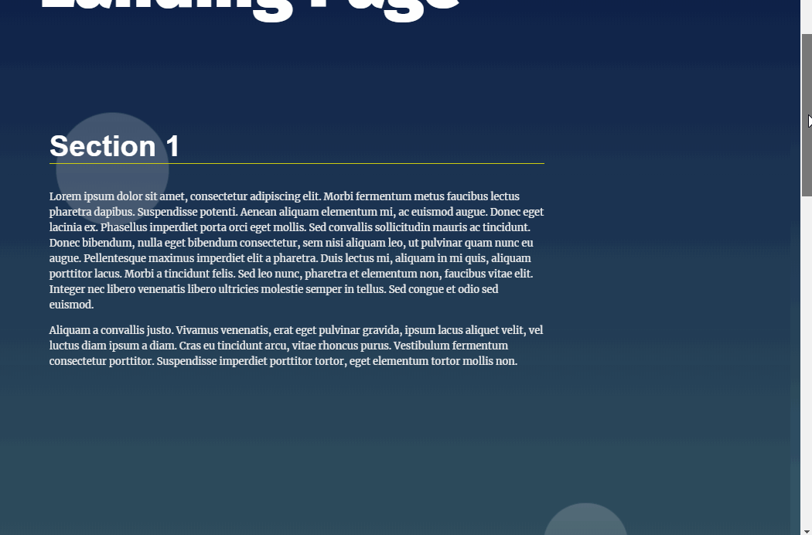
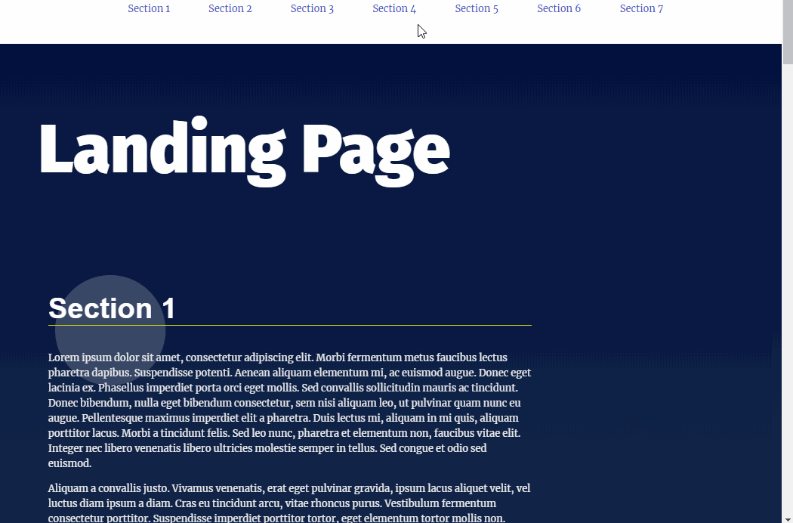

# Landing Page Project

## Table of Contents

* [Instructions](#instructions)
* [Starting-state](#starting-state)
* [Modifications](#modifications)

## Instructions

To access my landing page, clone or download the files in the repository, P2-Landing-Page. Then, drag the index.html file into your browser. Click on the different sections in the navigation bar at the top of the page, to see my work in action.

## Starting-state

This starter project began with some HTML and CSS styling to display a static version of the Landing Page project which was provided by Udacity. 

## Modifications

I added a JavaScript file to modify the HTML and CSS.

Specifically I...
1. linked a JavaScript file to the index.html
2. added JavaScript to dynamically add a navigation bar at the page top. The JavaScript grabbed the section names and put them in the navigation bar
3. used listeners on each section name in the navigation bar. When a section name is clicked on, the window scrolls to that section.
4. marked the section selected as active and used JavaScript to change the CSS, hightlighting the section that was selected in the navigation bar.
5. scrolled to a new section when that new section name is click in the navigation bar, unhighlighting the old active section and highlighting the new active section.

